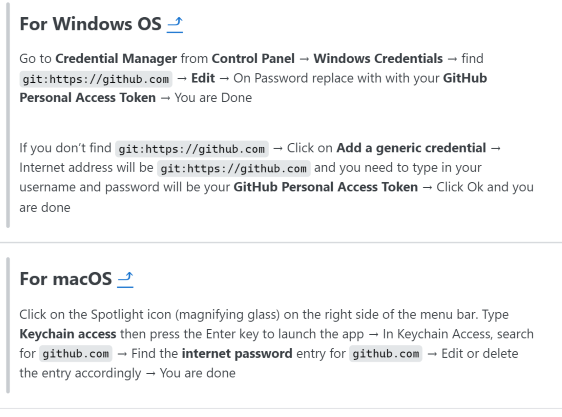

## Inhaltsverzeichnis<a name="Inhaltsverzeichnis"></a>
* [1 Kinoklub](#A_1_Kinoklub)
* [2 Installation](#A_2_Installation)
* [3 Git Passwort / Personal Access Token (PAT)](#A_3_Git Passwort / Personal Access Token (PAT))
* [4 Datensätze](#A_4_Datensätze)
    + [4.1 Advance-Tickets](#A_4.1_Advance-Tickets)
        + [4.1.1 Eintritte](#A_4.1.1_Eintritte)
        + [4.1.2 Kiosk](#A_4.1.2_Kiosk)
        + [4.1.3 Shows](#A_4.1.3_Shows)
    + [4.2 Excel Dateien](#A_4.2_Excel Dateien)
        + [4.2.1 Einkaufspreise](#A_4.2.1_Einkaufspreise)
        + [4.2.2 Spezialpreise Kiosk](#A_4.2.2_Spezialpreise Kiosk)
        + [4.2.3 Verleiherabgaben](#A_4.2.3_Verleiherabgaben)
        + [4.2.4 Einnahmen und Ausgaben](#A_4.2.4_Einnahmen und Ausgaben)
* [5 Script Konfiguration](#A_5_Script Konfiguration)
    + [5.1 Abrechnung für Filmvorführungen](#A_5.1_Abrechnung für Filmvorführungen)
    + [5.2 Inhaltsverzeichnisse](#A_5.2_Inhaltsverzeichnisse)
    + [5.3 Mehrwertsteuersatz](#A_5.3_Mehrwertsteuersatz)
    + [5.4 Platzkategorien ohne Umsatz die dennoch abgerechnet werden müssen.](#A_5.4_Platzkategorien ohne Umsatz die dennoch abgerechnet werden müssen.)
    + [5.5 Ausgabeformate](#A_5.5_Ausgabeformate)
* [6 Ablauf](#A_6_Ablauf)
* [7 Berichte](#A_7_Berichte)
    + [7.1 Abrechnung Filmvorführung](#A_7.1_Abrechnung Filmvorführung)
    + [7.2 Jahresabrechnungen](#A_7.2_Jahresabrechnungen)
    + [7.3 Statistik](#A_7.3_Statistik)
    + [7.4 Daten als Excel-Datei](#A_7.4_Daten als Excel-Datei)
* [8 Versionshistorie](#A_8_Versionshistorie)


Author: Florian Wagner\
Script Version:\
2024 V1.3

```{r setup, include=FALSE}
knitr::opts_chunk$set(echo = FALSE)
act_date <- Sys.time()|>as.Date()
act_date <- paste0(lubridate::day(act_date),".", lubridate::month(act_date),".", lubridate::year(act_date))
```

Dokumentation wurde am `r act_date` erstellt.


\newpage
## 1 Kinoklub<a name="A_1_Kinoklub"></a>
[Inhaltsverzeichnis](#Inhaltsverzeichnis)


Script zur Abrechnung für den Kinoklub TaB. Um die Abrechnung für den Kinoklub zu vereinfachen respektive zu automatisieren wurde dieser Script erstellt.\
Dieser Skrip kann mit folgendem Befehl ausgeführt werden:

```         
source("Erstelle Abrechnung.R")
```

\
Bei Fehlern kann ein "Issue" in Github erfasst werden.\
\
Die Datei "README.md" und die Dokumentation wird automatisch erstellt.

```         
source("doc/create Readme and Docu.R")
```

Eine Änderung muss deshalb in der Datei **"doc/README.Rmd"** vorgenommen werden.


\newpage
## 2 Installation<a name="A_2_Installation"></a>
[Inhaltsverzeichnis](#Inhaltsverzeichnis)


1.  Download and install R\
    <https://cran.r-project.org/bin/windows/base/>
2.  Download and install Rstudio\
    <https://posit.co/download/rstudio-desktop/>
3.  Download git:\
    <https://git-scm.com/downloads>
4.  Kionklub Scripts download: Navigate to folder you would like to install the Scripts

```         
    git clone https://github.com/slvwagner/Kinoklub
```

6.  Start Rstudio from the Kinoklub folder, or open the project with Rstudio "Kinoklub.Rproj".
7.  Install the needed packages in the R Terminal

```         
    install.packages("rmarkdown")
    install.packages("tidyverse")
    install.packages("rebus")
    install.packages("openxlsx")
    install.packages("flextable")
    install.packages("magick")
    install.packages("webshot")
    install.packages("xml2")
```

7.  Run this command once in R-Terminal, error MSG can be ignored

```         
    webshot::install_phantomjs()
```

8.  Run the Script:

```         
    source("Erstelle Abrechnung.R")
```


\newpage
## 3 Git Passwort / Personal Access Token (PAT)<a name="A_3_Git Passwort / Personal Access Token (PAT)"></a>
[Inhaltsverzeichnis](#Inhaltsverzeichnis)

Git Passwort gibt es seit 2021 nicht mehr. Um sich bei Git anzumelden, muss man auf der GitHub Webseite unter dem eigenen Profil in den Einstellungen auf **Developer Settings** navigieren. Dann unter **Personal access tokens** **Tokens (classic)** anwählen. Oben rechts auf **Generate new token** klicken und **classic** auswählen. Dem Token einen Namen geben und **Expiration** auf **No Expiration** setzen. Danach alle **repo** anwählen. Nach unten scrollen und Token generieren. Token kopieren und Anleitung unten im Bild folgen. \



\newpage
## 4 Datensätze<a name="A_4_Datensätze"></a>
[Inhaltsverzeichnis](#Inhaltsverzeichnis)


### 4.1 Advance-Tickets<a name="A_4.1_Advance-Tickets"></a>
[Inhaltsverzeichnis](#Inhaltsverzeichnis)


Die Datensätze können von <https://www.advance-ticket.ch/admin> heruntergeladen werden und sind unter dem Verzeichnis **.../Kinoklub/input/advance tickets/** abzuspeichern.

#### 4.1.1 Eintritte<a name="A_4.1.1_Eintritte"></a>
[Inhaltsverzeichnis](#Inhaltsverzeichnis)

**Eintritte 02.12.23.txt**  \
Copy paste von html für jede Vorführung und bitte speichern unter "input/advance tickets/Eintritt xx.xx.xx.txt" Es muss die Kalenderwoche sowie der Film ausgewählt werden.\


#### 4.1.2 Kiosk<a name="A_4.1.2_Kiosk"></a>
[Inhaltsverzeichnis](#Inhaltsverzeichnis)

**Kiosk 02.12.23.txt**  \
Copy paste von html für jede Vorführung und Speichern unter "input/advance tickets/Kiosk xx.xx.xx.txt".\
Im Menu auf "DecompteCaisse" <https://www.advance-ticket.ch/decomptecaisse?lang=de> navigieren.\
Spalte 1 Das Datum muss gewählt werden, Spalte 2 "reinach", Splate 3 "Atelierkino Kasse" und Spalte 4 "..." eingestellt werden.\


#### 4.1.3 Shows<a name="A_4.1.3_Shows"></a>
[Inhaltsverzeichnis](#Inhaltsverzeichnis)

**Shows.txt**  \
Copy paste von html für die gewünschte Abrechnungsperiode. Bitte speichern unter "input/advance tickets/Shows.txt"\
Im Menu auf "Shows" <https://www.advance-ticket.ch/shows?lang=de> navigieren.\
Spalte 1 startdatum wählen 1.1.20xx, Spalte 2 Enddatum wählen 31.12.20xx\


### 4.2 Excel Dateien<a name="A_4.2_Excel Dateien"></a>
[Inhaltsverzeichnis](#Inhaltsverzeichnis)


Im Verzeichniss **.../Kinoklub/input/** kann mit Hilfe von Excelfiles folgendes definiert werden:

#### 4.2.1 Einkaufspreise<a name="A_4.2.1_Einkaufspreise"></a>
[Inhaltsverzeichnis](#Inhaltsverzeichnis)


Die Einkaufspreise die ab einem bestimmten Datum gültig sind. "Einkauf Kiosk xx.xx.xx.xlsx"\
Die Einkaufspreise für die Kioskverkäufe müssen gepflegt werden. Ändern sich die Einkaufspreise so muss ein neues File mit neuerem gültigkeis Datum erstellt werden.\

-   Achtung!\
    Die alte Dateien dürfen nicht gelöscht werden.

#### 4.2.2 Spezialpreise Kiosk<a name="A_4.2.2_Spezialpreise Kiosk"></a>
[Inhaltsverzeichnis](#Inhaltsverzeichnis)


In der Datei **Spezialpreisekiosk.xlsx** müssen die Sonderangebote (Spez-Verkaufsartikel) definiert werden.\
Diese Datei wird benötigt um die Spezialpreise

-   Spez 1
-   Spez 2
-   Spez 3
-   Spez 4

nach zuschlagen.

#### 4.2.3 Verleiherabgaben<a name="A_4.2.3_Verleiherabgaben"></a>
[Inhaltsverzeichnis](#Inhaltsverzeichnis)


Die Verleiherabgaben müssen in der Datei **.../Kinoklub/input/Verleiherabgaben.xlsx** definiert werden.\

-   Im **Tab Verleiherabgaben** muss der **"minimal Abzug"** sowie **"Abzug %"** oder nur der **"Abzug fix [CHF]"** definiert werden.   Beide Einträge sind nicht erlaubt.

-   Im **Tab Kinoförderer gratis** muss für jeden Verleiher definiert werden, ob gewisse Platzkategorien (z.B.Kinoförderer Tickets) als gratis abgerechnet werden dürfen.\
    Wenn **nein** gewählt wird, dann werden zusätzlich die Platzkategorieen welche in `c_P_kat_verechnen` definiert sind, auch als Umsatz verrechnet.\
    Der Rechnungsbetrag der Verleiherrechnung an den Kinoklub wird demnach grösser.

#### 4.2.4 Einnahmen und Ausgaben<a name="A_4.2.4_Einnahmen und Ausgaben"></a>
[Inhaltsverzeichnis](#Inhaltsverzeichnis)


Alle Einnahmen und Ausgaben müssen in der Datei **.../Kinoklub/input/Einnahmen und Ausgaben.xlsx** definiert werden.\
Ja nach **Ausgabentyp** muss eine **Kategorie, (Buchhaltungskonto)** verwendet werden. Das ist nötig um die Einnahmen und Ausgaben korrekt in den  **Berichten** auszuwerten. 


\newpage
## 5 Script Konfiguration<a name="A_5_Script Konfiguration"></a>
[Inhaltsverzeichnis](#Inhaltsverzeichnis)


Die Datei **"Erstelle Abrechnung.R"** enhält am Anfang die folgenden definition die abgeändert werden können um das Verhalten des Scripts zu beeinflussen.

### 5.1 Abrechnung für Filmvorführungen<a name="A_5.1_Abrechnung für Filmvorführungen"></a>
[Inhaltsverzeichnis](#Inhaltsverzeichnis)


-   Für jede Filmvorführung eine Abrechnung erstellen.\
    `c_run_single` \<- TRUE
-   Es werden nur die Jahresabrechnung und die Statistik-Berichte erstellt.\
    `c_run_single` \<- FALSE

### 5.2 Inhaltsverzeichnisse<a name="A_5.2_Inhaltsverzeichnisse"></a>
[Inhaltsverzeichnis](#Inhaltsverzeichnis)


Sollen die erstellten Berichte mit Inhaltsverzeichniss erstellt werden?

-   Ja\
    `toc` \<- TRUE
-   Nein\
    `toc` \<- FALSE

### 5.3 Mehrwertsteuersatz<a name="A_5.3_Mehrwertsteuersatz"></a>
[Inhaltsverzeichnis](#Inhaltsverzeichnis)


c_MWST \<- 8.1 #%

### 5.4 Platzkategorien ohne Umsatz die dennoch abgerechnet werden müssen.<a name="A_5.4_Platzkategorien ohne Umsatz die dennoch abgerechnet werden müssen."></a>
[Inhaltsverzeichnis](#Inhaltsverzeichnis)


Für gewisse Verleiher müssen zusätzliche Platzkategorieen abgerechnet werden. Die Defintion findet sich in der Datei "Verleiherabgaben.xlsx" TAB "Kinoförderer gratis".\
Die Variable `df_P_kat_verechnen` definiert welche Platzkategorien ohne Umsatz zusätzlich verrechnet werden und zu welchem Preis.\
`df_P_kat_verechnen` \<- tibble(Kinoförderer = "Kinoförderer", Verkaufspreis = 13)  

### 5.5 Ausgabeformate<a name="A_5.5_Ausgabeformate"></a>
[Inhaltsverzeichnis](#Inhaltsverzeichnis)


-   `c_render_option` \<- "1" only html
-   `c_render_option` \<- "2" only docx
-   `c_render_option` \<- "3" only pdf (Achtung für pdf install Latex for Windows (Miktex) for Mac (MacTex))
-   `c_render_option` \<- "4" html and docx
-   `c_render_option` \<- "5" html and pdf (Achtung für pdf install Latex for Windows (Miktex) for Mac (MacTex))
-   `c_render_option` \<- "6" docx and pdf (Achtung für pdf install Latex for Windows (Miktex) for Mac (MacTex))
-   `c_render_option` \<- "7" html, docx and pdf (Achtung für pdf install Latex for Windows (Miktex) for Mac (MacTex))


\newpage
## 6 Ablauf<a name="A_6_Ablauf"></a>
[Inhaltsverzeichnis](#Inhaltsverzeichnis)


"Erstelle Abrechnung.R" Script führt folgendes auf.

1.    Konfigurations variablen erstellen.
2.    Die Daten werden mit Script "read and convert.R" eingelesen und Konvertiert. Der Script "read and convert.R" benötigt "function.R" und "Kiosk.R"
3.    Erstellen Statistikbericht 
3.    Erstellen Jahresbericht
4.    Erstellen Jahresbericht detailed
5.    Erstellen Abrechnung Filmvorführung pro Datum respektive Vorführung
6.    Site-Map mit Berichtvorschau wird erstellt
7.    Daten für Webserver werden erstellt. 


\newpage
## 7 Berichte<a name="A_7_Berichte"></a>
[Inhaltsverzeichnis](#Inhaltsverzeichnis)


Alle Dateien die erzeugt wurden finden sich im **.../Kinoklub/output/** Verzeichniss.

-   Für jede Filmvorführung respektive Datum wird ein Abrechnung erstellt.
-   Es wird eine Jahresbarechnung und eine detalierte Jahresabrechnung erstellt.
-   Es wird eine Statistik mit Porgnosen erstellt.
-   Alle verwendeten Datensätze werden in ein Excelfile abgespeichert.

### 7.1 Abrechnung Filmvorführung<a name="A_7.1_Abrechnung Filmvorführung"></a>
[Inhaltsverzeichnis](#Inhaltsverzeichnis)


Es wird eine Filmabrechnung pro Event (Datum) erstellt.

-   Übericht\
-   Filmvorführung
    -   Kino Besucherzahlen und Umsatz
        -   Filmabgaben\

        -   Verleiherrechnung\
            In der Datei **".../Kinoklub/input/Einnahmen und Ausgaben.xlsx"** in den **Ausgaben**\
            wird die Kategorie **Verleiher** berücksichtigt.

        -   Prozentualle Abgaben\
            Der Suisaabzug wird vom Umsatz berechnet.\

            In der Datei **".../Kinoklub/input/Verleiherabgaben.xlsx"** sind **Abzug %**, **Minimal Abzug** oder **Abzug fix [CHF]** definiert.\

            1.  Fall:\
                **Netto3** x **Abzug %** \> **Minimal Abzug**\
                Verleiherabzug: **Netto3** x **Abzug %**
            2.  Fall:\
                **Netto3** x **Abzug %** \< **Minimal Abzug**\
                Verleiherabzug: **Minimal Abzug**\
            3.  Fall:\
                **Abzug fix [CHF]**\
                Verleiherabzug: **Abzug fix [CHF]**

        -   Reklamematerial und Porto\
            Das **Reklamematerial und Porto** werden aus der Differenz der **Verleiherrechnung** und den **Prozentualle Abgaben** berechnet.

        -   MWST auf Verleiherrechnung\

            1.  Fall: Vereiherrechnung vorhanden\
                MWST wird mit der Verleiherrechnung berechnet.
            2.  Fall: Vereiherrechnung nicht vorhanden\
                MWST wird aus dem Umsatz berechnet.\
    -   Gewinn / Verlust aus Tickerverkauf\
        Der Gewinn/Verlust wird aus **Umsatz** - (**Suisa-Abzug**+**Verleiherabzug**+**MWST**+**Reklamematerial und Porto**)
-   Event
    -   Einnahmen
        -   In der Datei **".../Kinoklub/input/Einnahmen und Ausgaben.xlsx"** in den **Ausgaben**\
            wird die Kategorie **Vermietung** wird pro Filmabrechnung (Datum) berücksichtigt.
    -   Ausgaben
        -   In der Datei **".../Kinoklub/input/Einnahmen und Ausgaben.xlsx"** in den **Ausgaben**\
            wird die **Eventausgaben** wird pro Filmabrechnung (Spieldatum) berücksichtigt.
-   Kiosk
    -   Gewinn pro Artikel\
        In der Datei **".../Kinoklub/input/Einkauf Kiosk xx.xxx.xx.xlsx"** ist der Gewinn pro Artikel definiert.
    -   Umsatz Für den Verkaufsartikel gibte es keine Definition in der Datei **".../Kinoklub/input/Einkauf Kiosk xx.xxx.xx.xlsx"**\
    -   Einnahmen\
        Die Einnahmen werden aus Gewinn pro Artikel und dem Umsatz für Spezialpreise berechnet.
    -   Ausgaben\
        Achtung!\
        Für Verkaufsartikel ohne Lieferant müssen Eventausgaben definiert werden.
-   Kioskumsatz pro Gast
    -   Kioskumsatz aller Gäste
    -   Kioskumsatz pro zahlender Gast
-   Kasse\
    Die Kioskkasse wird auch für Barauszahlung von stornierten Tickets genutzt.
-   Gewinn / Verlust\
    Summe aus Einnahmen und Ausgaben


### 7.2 Jahresabrechnungen<a name="A_7.2_Jahresabrechnungen"></a>
[Inhaltsverzeichnis](#Inhaltsverzeichnis)


Die Einnahmen und Ausgaben werden für die Jahresabrechnung verwendet und je nach Kategorie der Rechnung zugewiesen. Die folgenden Kategorien werden in den Jahresrechnungen separat behandelt.

-   Filmvorführungen\
    -   Eintritt
        -   Einnahmen Ticketverkauf
        -   Abgaben Ticketverkauf
            -   Suisaabgaben
            -   Verleiherabgaben
            -   Nebenkosten
            -   MWST auf Verleiherleistungen
-   Event
    -   Eventeinnahmen\
        Einnahmen für den Event, z.B. Beiträgemitveranstalter, Eventsponsoring, ...
    -   Eventausgaben\
        Alle Ausgaben die für den Event, z.B. Werbung, Esswaren, Spesen, …
-   Kiosk
    -   Einnahmen\
        Die Einnahmen werden mit **"Anzahl x Verkaufspeis für Verkaufsartikel"** berechnet.
    -   Ausgaben
        -   Einkauf Getränke\
            Die Getränke werden von Theater am Bahnhof eingekauft.\
            Falls in der Datei **.../Kinoklub/input/Einkauf Kiosk xx.xx.xx.xlsx** der Lieferant **"Schüwo"** definiert wurde wird der Verkaufsartikel als Getränk ausgegeben.\
            Der Getränkeeinkauf wird mit **"Anzahl x Einkaufspreis"** berechnet.
        -   Einkauf Kino\
            Für alle Verkaufsartikel mit Ausnahme der Getränke wird in der Datei **".../Kinoklub/input/Einnahmen und Ausgaben.xlsx"**   mit Kategorie **Kiosk** definiert.
-   Abos / Kinogutscheine
    - Einnahmen
        - Abos
        - Kinogutscheine
        - Summe
    - Eingelöst
        - Abos
        - Kinogutscheine
    - Kurzfristiges zinsloses Fremd-Kapital
-   Vermietung\
    -   Einnahmen\
        Vermietung Kinosaal, Beiträge von mit Veranstallter, ...
    -   Ausgaben\
        Mietkosten für Filme und Material, ...
-   Werbung
    -   Einnahmen\
        Die Werbeeinnahme aus Kinowerbung druch Trailers, Dias für Sponsoren, ...
    -   Ausgaben\
        Inserate, Drucksachen, Homepage, ...
-   Personalaufwand\
    Löhne
-   Sonstiges
    -   Einnahmen\
        Sponsoen, Gönner, Kulturbeiträge, ...
    -   Ausgaben\
        Kinomiete an Theater am Bahnhof AG, Mitgliederbeiträge, Ciné Bulletin, ...


### 7.3 Statistik<a name="A_7.3_Statistik"></a>
[Inhaltsverzeichnis](#Inhaltsverzeichnis)


-   Gewinn/Verlust
    -   Prognose\
        Die Prognose wird mit der Kumuliertensumme pro Datum als lineares Model erstellt.
-   Ticketverkauf
    -   Prognose\
        Die Prognose wird mit der Kumuliertensumme pro Datum als lineares Model erstellt.
    -   Eintritte
        -   Anzahl\
            Diagramm
        -   Umsatz
            -   Prognose\
                Die Prognose wird mit der Kumuliertensumme pro Datum als lineares Model erstellt.
    -   Filmabgaben
        -   Prognose\
            Die Prognose wird mit der Kumuliertensumme pro Datum als lineares Model erstellt.
-   Abos
    -   Einnahmen
    -   Eingelöst
    -   Kredit
-   Kiosk-Gewinn pro Vorführung
    -   Prognose\
        Die Prognose wird mit der Kumuliertensumme pro Datum als lineares Model erstellt.
-   Kiosk
    -   Verkaufsartikel
    -   Ladenhüter (keine Verkäufe)
    -   Kiosk Umsatz pro Gast
        -   Prognose\
            Die Prognose wird mit der Kumuliertensumme pro Datum als lineares Model erstellt.
    -   Umsatz pro zahlender Gast
        -   Prognose\
            Die Prognose wird mit der Kumuliertensumme pro Datum als lineares Model erstellt.

### 7.4 Daten als Excel-Datei<a name="A_7.4_Daten als Excel-Datei"></a>
[Inhaltsverzeichnis](#Inhaltsverzeichnis)

Die Eingelesenen und verarbeiteten Datensätze werden in einen Excel-Datei gespeichert. \
```
.../Kinoklub/output/Auswertung.xlsx
```


\newpage
## 8 Versionshistorie<a name="A_8_Versionshistorie"></a>
[Inhaltsverzeichnis](#Inhaltsverzeichnis)


2024 V1.0 Go Live mit Stefan Jablonski, Nadia und Florian Wagner  \
2024 V1.1 Verkauf von Abos und Gutscheinen wird in der Jahresabarechnung berücksichtigt    \
2024 V1.2 Abrechnung für Kinowerbung hinzugefügt:..../output/Auswertung.xlsx und Prognosen in der Statistik überarbeitet  \
2024 V1.3 Neuer Bericht Statistik_DT hinzugefügt. Interaktives durchsuchen aller Tabellen   \


