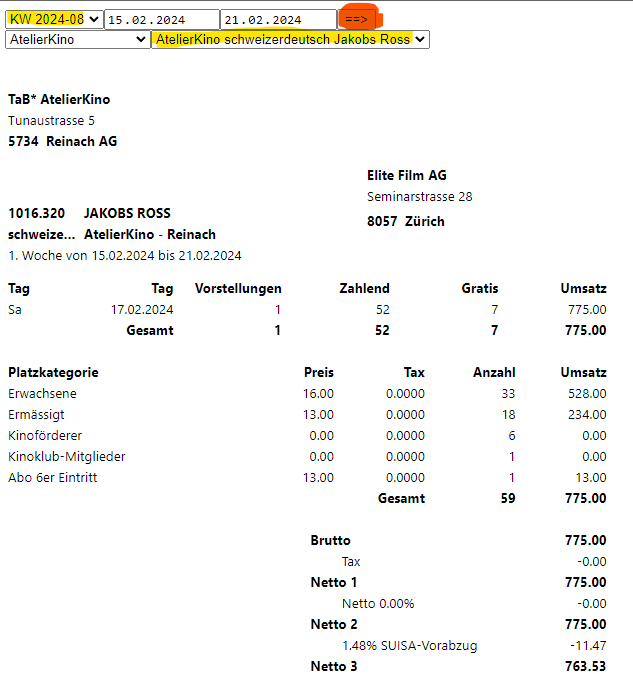
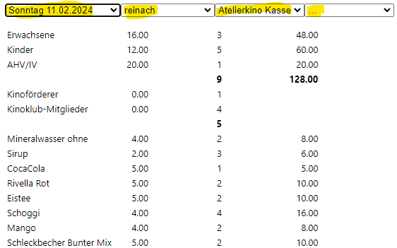
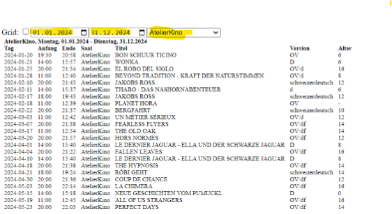

# Inhaltsverzeichnis<a name="Inhaltsverzeichnis"></a>
* [1 Kinoklub](#A_1_Kinoklub)
    + [1.1 Installation](#A_1.1_Installation)
    + [1.2 Datensätze](#A_1.2_Datensätze)
    + [1.3 Konfigurations Dateien](#A_1.3_Konfigurations Dateien)
    + [1.4 Ausgabe](#A_1.4_Ausgabe)


# 1 Kinoklub<a name="A_1_Kinoklub"></a>
[Inhaltsverzeichnis](#Inhaltsverzeichnis)

Author: Florian Wagner \
\
Script zur Abrechnung für den Kinoklub TaB. 
Um die Abrechnung für den Kinoklub zu vereinfachen respektive zu automatisieren wurde dieser Script erstellt. \
Dieser Skrip kann mit folgendem Befehl ausgeführt werden:
```
source("Erstelle Abrechnung.R")
```
\
Bei Fehlern kann ein "Issue" in Github erfasst werden. \
\
Die Datei "README.md" wird automatisch beim erstellen der Abrechnung erstellt. Eine Änderung muss deshalb in der Datei "doc/README.Rmd" vorgenommen werden.  

## 1.1 Installation<a name="A_1.1_Installation"></a>
[Inhaltsverzeichnis](#Inhaltsverzeichnis)


1.  Download and install R \
    <https://cran.r-project.org/bin/windows/base/>
2.  Download and install Rsudio \
    <https://posit.co/download/rstudio-desktop/>
3.  Download git: \
    <https://git-scm.com/downloads>
5.  Kionklub Scripts download:
    Navigate to folder you would like to install the Scripts
```
    git clone https://github.com/slvwagner/Kinoklub
```
6.  Start Rstudio from the Kinoklub folder.
7.  Install the needed packages in the R Terminal
```
    install.packages("rmarkdown")
    install.packages("tidyverse")
    install.packages("rebus")
    install.packages("openxlsx")
    install.packages("flextable")
```
8.  Run the Script:
```
    source("Erstelle Abrechnung.R")
```

## 1.2 Datensätze<a name="A_1.2_Datensätze"></a>
[Inhaltsverzeichnis](#Inhaltsverzeichnis)


Die Datensätze können von <https://www.advance-ticket.ch/admin> heruntergeladen werden und sind unter dem Verzeichnis
**.../Kinoklub/input/advance tickets/** abzuspeichern.

-   "Eintritte 02.12.23.txt" \
    Copy paste von html für jede Vorführung und bitte speichern unter "input/advance tickets/Eintritt xx.xx.xx.txt"
    Es muss die Kalenderwoche sowie der Film ausgewählt werden. \
    
-   "Kiosk 02.12.23.txt"" \
    Copy paste von html für jede Vorführung und Speichern unter "input/advance tickets/Kiosk xx.xx.xx.txt". \
    Im Menu auf "DecompteCaisse" <https://www.advance-ticket.ch/decomptecaisse?lang=de> navigieren.   
    Spalte 1 Das Datum muss gewählt werden, Spalte 2 "reinach", Splate 3 "Atelierkino Kasse" und Spalte 4 "..." eingestellt werden. \
    
-   "Shows.txt" \
    Copy paste von html für die gewünschte Abrechnungsperiode. Bitte speichern unter "input/advance tickets/Shows.txt" \
    Im Menu auf "Shows" <https://www.advance-ticket.ch/shows?lang=de> navigieren. \
    Spalte 1 startdatum wählen 1.1.20xx, Spalte 2 Enddatum wählen 31.12.20xx
    
    

## 1.3 Konfigurations Dateien<a name="A_1.3_Konfigurations Dateien"></a>
[Inhaltsverzeichnis](#Inhaltsverzeichnis)


Im Verzeichniss **.../Kinoklub/input/** kann mit Hilfe von Excelfiles folgendes definiert werden:

-   "Einkauf Kiosk xx.xx.xx.xlsx" \
    Die Einkaufspreise für die Kioskverkäufe müssen gepflegt werden. Ändern sich die Einkaufspreise so muss ein neues File erstellt werden. 
    Die älteren Dateien dürfen nicht gelöscht werden.
-   "Spezialpreisekiosk.xlsx" \
    Definition der Sonderangebote \
    Diese Datei wird benötigt um die Spezialpreise Spez 1 / Spez 2 / Spez 3 / Spez 4 nachzuschlagen. 
-   "Verleiherabgaben.xlsx" \
    Im **Tab Verleiherabgaben** muss der "minimal Abzug" sowie "Abzug %" definiert werden oder nur der "Abzug fix [CHF]" definiert werden. Beide Einträge sind nicht erlaubt. \
    Im **Tab Kinoförderer gratis** muss für jeden Verleiher definiert werden ob die Kinoförderer als gratis abgerechnet werden dürfen. Wenn **nein** gewählt wurde dann werden die Kinoföderer als    
    Für gewisse Verleiher dürfen keine  
-   "Einnahmen und Ausgaben.xlsx" \
    Einnahmen und Ausgaben aus Rechnungen und Gutschrifften. \
    

## 1.4 Ausgabe<a name="A_1.4_Ausgabe"></a>
[Inhaltsverzeichnis](#Inhaltsverzeichnis)

Alle Dateien die erzeugt wurden finden sich im **.../Kinoklub/output/** Verzeichniss.

- Für jede Vorführung respektive Datum wird ein Abrechnung erstellt.
- Die Erfolgsrechnung wird über alle Datensätze erstellt.
- Zusätzliche Daten sind in der Statistik ersichtlich.
- Alle verwendeten Datensätze werden in ein Excelfile abgespeichert.


